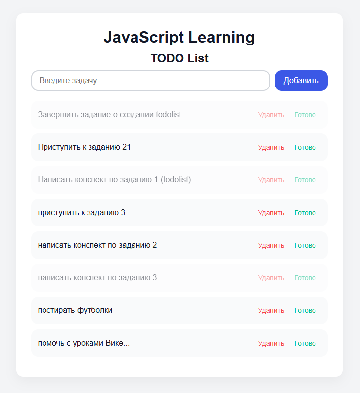

# 📝 TODO List — проект на JavaScript

Небольшой и простой список задач, созданный в процессе практики JavaScript.  
Проект демонстрирует работу с DOM, событиями и сохранением данных в localStorage, а также аккуратный пользовательский интерфейс с адаптивной вёрсткой и плавными анимациями.

**Демонстрация** - https://nataliyayadykina.github.io/todolistJS/

## ✨ Функциональность

• Добавление задач  
• Удаление задач  
• Отмечание задач как выполненных  
• Редактирование текста задачи по клику  
• Автосохранение данных через localStorage  
• Красивый интерфейс и анимации  
• Адаптивная верстка под разные устройства

## 📁 Структура проекта

`index.html` — HTML-разметка  
`style.css` — стили, анимации, адаптив  
`script.js` — логика приложения

## 🚀 Как запустить проект

1. Скачайте репозиторий или клонируйте:

   `git clone https://github.com/NataliyaYadykina/todolistJS.git`

2. Откройте файл `index.html` в браузере.

Проект не требует сборки, серверов и дополнительных зависимостей.

